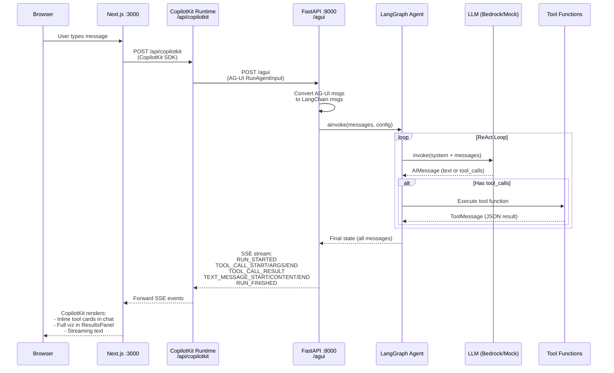
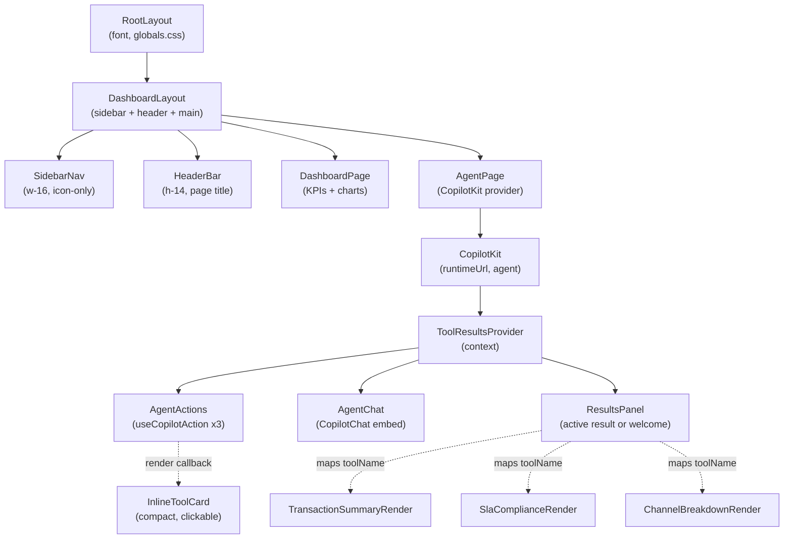
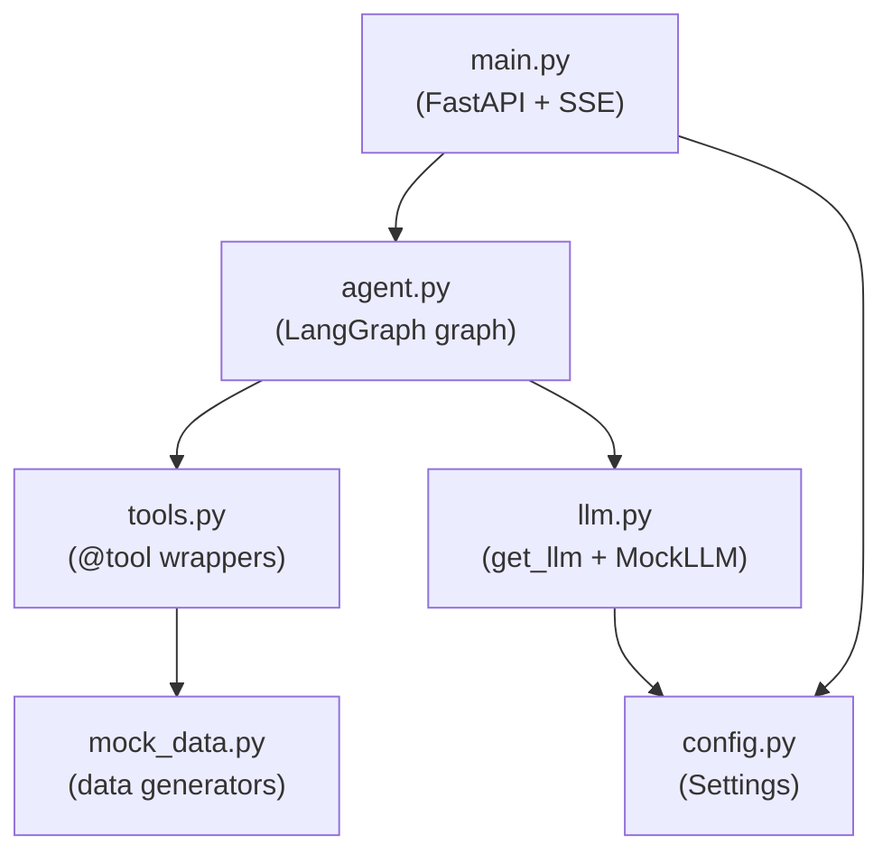
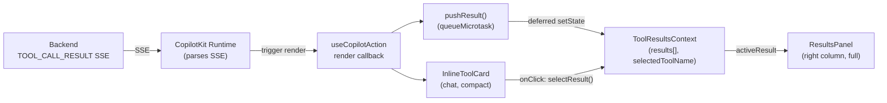
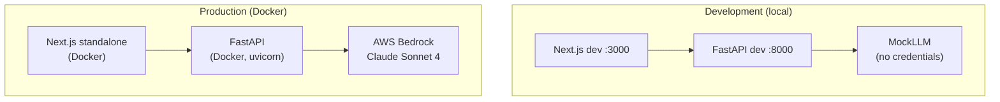

# Architecture -- Detailed Diagrams

<!-- reviewed: 2026-02-16 -->

## Request Flow (User Message -> Agent Response)

## Frontend Component Tree

## Backend Module Dependency

## Data Flow: Tool Result -> UI

## Deployment Topology

## AG-UI Protocol Event Types

| Event | Direction | Purpose |
|-------|-----------|---------|
| `RUN_STARTED` | Server -> Client | Signals agent run begins |
| `TEXT_MESSAGE_START` | Server -> Client | Opens a new text message |
| `TEXT_MESSAGE_CONTENT` | Server -> Client | Streamed text chunk (20 chars) |
| `TEXT_MESSAGE_END` | Server -> Client | Closes the text message |
| `TOOL_CALL_START` | Server -> Client | Agent wants to call a tool |
| `TOOL_CALL_ARGS` | Server -> Client | Tool arguments (JSON delta) |
| `TOOL_CALL_END` | Server -> Client | Tool call metadata complete |
| `TOOL_CALL_RESULT` | Server -> Client | Tool execution result |
| `STATE_SNAPSHOT` | Server -> Client | Full agent state (non-message fields) |
| `RUN_ERROR` | Server -> Client | Error during execution |
| `RUN_FINISHED` | Server -> Client | Agent run complete |
