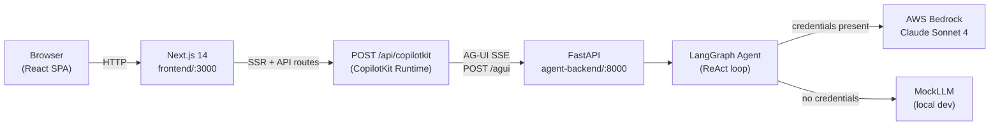

# ag-starter

Full-stack fintech FinOps platform: Next.js 14 dashboard + Python LangGraph agent connected via AG-UI protocol.

<!-- reviewed: 2026-02-16 -->
<!-- charts migrated from @tremor/react to shadcn/ui (Recharts v3) on 2026-02-16 -->

## Architecture

**Data flow:** Browser -> Next.js -> `/api/copilotkit` (CopilotKit Runtime + HttpAgent) -> FastAPI `/agui` -> LangGraph agent -> LLM -> SSE stream back through the same chain.

## Commands

| Action | Frontend (`cd frontend`) | Backend (`cd agent-backend`) |
|--------|--------------------------|------------------------------|
| Install | `npm install` | `uv pip install --system .` |
| Dev | `npm run dev` | `uvicorn app.main:app --reload` |
| Build | `npm run build` | `docker build -t ag-backend .` |
| Lint | `npm run lint` | `ruff check app/` |
| Type check | `npx tsc --noEmit` | `mypy app/` |

Both servers MUST be running for the agent chat to work. Frontend defaults to `http://localhost:8000` for the backend (`AGENT_BACKEND_URL` env var).

## Code Conventions

1. **"use client" at component top** -- Next.js App Router requires explicit client component marking. Every component using hooks, browser APIs, or CopilotKit MUST have this directive. Server components are the default.

2. **Render-only CopilotKit actions** -- Frontend tools use `available: "disabled"` so the backend owns execution. The `render` callback returns UI; the backend handles the actual tool call. Tool names MUST match exactly between `useCopilotAction({ name })` and `@tool` decorated Python functions.

3. **AG-UI SSE protocol** -- Backend streams events as `data: {json}\n\n` frames. Event types: `RUN_STARTED`, `TEXT_MESSAGE_*`, `TOOL_CALL_*`, `TOOL_CALL_RESULT`, `STATE_SNAPSHOT`, `RUN_FINISHED`. Do NOT use `\r\n` — the AG-UI client parser splits on `/\n\n/`.

4. **Deferred state updates in render props** -- CopilotKit render callbacks execute during React's render phase. Use `queueMicrotask()` to defer `setState` calls (see `tool-results-context.tsx`). Direct setState in render props causes React warnings.

5. **Pydantic Settings for config** -- Backend uses `pydantic-settings` with `.env` file support. All config has sensible defaults for local dev (MockLLM when no AWS creds). NEVER commit `.env` files with real credentials.

## Gotchas

- **CORS**: Backend allows `http://localhost:3000` only. If frontend runs on a different port (e.g., 3001), update `CORSMiddleware` in `app/main.py`.
- **Port conflicts**: Next.js auto-increments ports. Check the actual port in terminal output and update backend CORS accordingly.
- **No real LLM by default**: Without `AWS_ACCESS_KEY_ID` + `AWS_SECRET_ACCESS_KEY` in backend `.env`, the `MockLLM` responds with hardcoded keyword-matched tool calls. This is intentional for local dev.
- **CopilotKit web inspector**: Set `enableInspector={false}` on `<CopilotKit>` to hide the floating debug widget on localhost. Separate from `showDevConsole`.
- **Pre-existing type error**: `route.ts:44` has a type mismatch from duplicate `@ag-ui/client` versions in CopilotKit. This is a known upstream issue — `npm run build` shows "Compiled successfully" before the type check fails.

## Do-Not List

- MUST NOT commit `.env` files with AWS credentials
- MUST NOT use `\r\n` in AG-UI SSE events (breaks the parser)
- MUST NOT call `setState` directly inside CopilotKit render callbacks (use `queueMicrotask`)
- MUST NOT rename tool functions without updating both frontend action names and backend `@tool` decorators
- SHOULD NOT add `overflow-y-auto` to the dashboard layout `<main>` — individual pages manage their own scroll

## Supplementary Docs

- [`.claude/rules/code-style.md`](.claude/rules/code-style.md) -- React + Python conventions (what linters miss)
- [`.claude/rules/testing.md`](.claude/rules/testing.md) -- Test strategy and runners
- [`.claude/rules/architecture.md`](.claude/rules/architecture.md) -- Detailed diagrams: request flow, data flow, deployment
- [`agent_docs/domain-glossary.md`](agent_docs/domain-glossary.md) -- Domain terms mapped to TS interfaces + Pydantic models
- [`agent_docs/dependency-map.md`](agent_docs/dependency-map.md) -- External services and integrations
