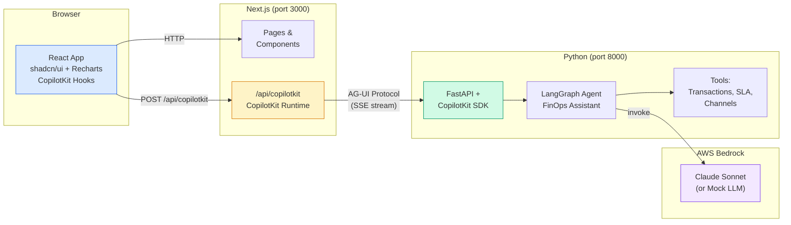

# ag-starter

A multi-tenant fintech platform starter that combines a modern React UI layer with an agentic AI backend connected via the AG-UI protocol.

## Architecture



### How it works

1. **Browser** — React app built with Next.js App Router, styled with shadcn/ui components and Recharts (via the shadcn/ui chart pattern). CopilotKit React hooks (`useCopilotAction`, `useCopilotReadable`, `useCoAgentStateRender`) connect the UI to the agent.

2. **Next.js API Route** (`/api/copilotkit`) — Hosts the CopilotKit runtime. This is the bridge layer that translates between CopilotKit's React protocol and the AG-UI event stream. It lives inside Next.js for simplicity (same-origin, single deployment).

3. **Python Agent Backend** — FastAPI server exposing a CopilotKit-compatible endpoint. Uses the `copilotkit` Python SDK to wire a LangGraph agent to AG-UI protocol events.

4. **LangGraph Agent** — A ReAct-pattern agent ("FinOps Assistant") with tools for querying transaction data, SLA compliance, and payment channel breakdowns. Uses AWS Bedrock (Claude Sonnet) as the LLM, with an automatic mock fallback for local dev.

### Why the CopilotKit runtime lives in Next.js

- **Simplicity** — One deployment, no separate Node.js service to manage
- **Same-origin** — No CORS needed between frontend and runtime
- **Shared context** — Can access Next.js sessions/cookies if auth is added later

### When to extract it

- **Multi-frontend** — Mobile apps or other SPAs need the same agent
- **Independent scaling** — Runtime needs different compute than the UI
- **Network isolation** — Compliance (PCI-DSS) requires the agent bridge in a separate zone

## Prerequisites

- Node.js 20+
- Python 3.11+
- [uv](https://docs.astral.sh/uv/) (Python package manager)
- Docker & Docker Compose (for containerized setup)

## Quick Start

### Option 1: Docker (recommended)

```bash
# Clone and enter the project
cd ag-starter

# Copy environment template
cp .env.example .env

# Start everything (uses mock LLM if no AWS credentials)
docker-compose up --build
```

Open [http://localhost:3000](http://localhost:3000) in your browser.

### Option 2: Local development

**Terminal 1 — Agent Backend:**

```bash
cd agent-backend
uv venv
uv pip install -e .
source .venv/bin/activate
uvicorn app.main:app --reload --port 8000
```

**Terminal 2 — Frontend:**

```bash
cd frontend
npm install
npm run dev
```

Open [http://localhost:3000](http://localhost:3000) in your browser.

### Option 3: Docker dev mode (with hot reload)

```bash
docker-compose -f docker-compose.yml -f docker-compose.dev.yml up --build
```

## Project Structure

```
ag-starter/
├── frontend/                          # Next.js 14+ App Router
│   ├── src/
│   │   ├── app/
│   │   │   ├── api/copilotkit/        # CopilotKit runtime (AG-UI bridge)
│   │   │   ├── dashboard/             # Dashboard pages
│   │   │   │   ├── agent/             # Agent interaction page
│   │   │   │   └── page.tsx           # Main dashboard with KPIs
│   │   │   ├── layout.tsx             # Root layout with Inter font
│   │   │   └── page.tsx               # Landing / login page
│   │   ├── components/
│   │   │   ├── agent/                 # CopilotKit integration components
│   │   │   ├── dashboard/             # Dashboard-specific components
│   │   │   └── ui/                    # shadcn/ui primitives
│   │   └── lib/                       # Utilities and mock data
│   ├── tailwind.config.ts             # Tailwind config with shadcn/ui + chart colors
│   └── Dockerfile
│
├── agent-backend/                     # Python FastAPI + LangGraph
│   ├── app/
│   │   ├── main.py                    # FastAPI server + CopilotKit SDK
│   │   ├── agent.py                   # LangGraph agent (ReAct pattern)
│   │   ├── llm.py                     # Bedrock / mock LLM factory
│   │   ├── tools.py                   # Agent tools (transaction, SLA, channels)
│   │   ├── mock_data.py               # Realistic fintech mock data
│   │   └── config.py                  # Settings via pydantic-settings
│   ├── pyproject.toml
│   └── Dockerfile
│
├── docker-compose.yml                 # Production-like orchestration
├── docker-compose.dev.yml             # Dev overrides (hot reload, volumes)
├── .env.example                       # Environment variable template
└── README.md
```

## Pages

| Route | Description |
|---|---|
| `/` | Landing page with tenant-aware login placeholder |
| `/dashboard` | KPI cards (Recharts sparklines) + category breakdown (Recharts BarChart) |
| `/dashboard/agent` | CopilotKit chat sidebar + agent state display + action hooks |

## AG-UI Event Flow

The AG-UI protocol defines a standard event stream between AI agents and frontends:

```
RUN_STARTED
├── TEXT_MESSAGE_START
│   ├── TEXT_MESSAGE_CONTENT (streamed chunks)
│   └── TEXT_MESSAGE_END
├── TOOL_CALL_START
│   └── TOOL_CALL_END
├── STATE_DELTA (partial state updates)
└── RUN_FINISHED
```

These events flow: **LangGraph Agent** → **CopilotKit Python SDK** → **SSE stream** → **CopilotKit Runtime** (Next.js API route) → **CopilotKit React hooks** → **UI updates**

## Environment Variables

| Variable | Default | Description |
|---|---|---|
| `AWS_ACCESS_KEY_ID` | _(empty)_ | AWS credentials for Bedrock |
| `AWS_SECRET_ACCESS_KEY` | _(empty)_ | AWS credentials for Bedrock |
| `AWS_REGION` | `us-east-1` | AWS region |
| `BEDROCK_MODEL_ID` | `anthropic.claude-sonnet-4-20250514-v1:0` | Bedrock model ID |
| `AGENT_BACKEND_URL` | `http://localhost:8000` | Python agent backend URL |
| `DEFAULT_TENANT_ID` | `tenant-demo-001` | Default tenant for demo |

## Docs & Resources

- [CopilotKit](https://docs.copilotkit.ai) — React AI copilot framework
- [AG-UI Protocol](https://docs.ag-ui.com) — Agent-UI interaction protocol
- [shadcn/ui](https://ui.shadcn.com) — Beautifully designed components (including chart primitives built on Recharts)
- [Recharts](https://recharts.org) — Composable charting library for React
- [LangGraph](https://langchain-ai.github.io/langgraph/) — Stateful agent orchestration
- [AWS Bedrock](https://docs.aws.amazon.com/bedrock/) — Managed foundation models
