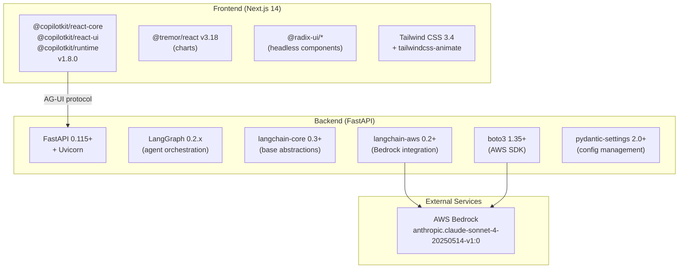

# Dependency Map -- External Services & Integrations

<!-- reviewed: 2026-02-16 -->

## Runtime Dependencies

## Service Details

### AWS Bedrock (LLM)

| Property | Value |
|----------|-------|
| Service | Amazon Bedrock |
| Model | `anthropic.claude-sonnet-4-20250514-v1:0` |
| Region | `us-east-1` (configurable via `AWS_REGION`) |
| Auth | IAM credentials (`AWS_ACCESS_KEY_ID` + `AWS_SECRET_ACCESS_KEY`) |
| Fallback | `MockLLM` when credentials not present |
| Parameters | temperature=0.3, max_tokens=2048 |

### CopilotKit Runtime

| Property | Value |
|----------|-------|
| Version | 1.8.0 |
| Frontend | `@copilotkit/react-core`, `@copilotkit/react-ui` |
| Backend bridge | `@copilotkit/runtime` (in Next.js API route) |
| Protocol | AG-UI (SSE-based) |
| Endpoint | `POST /api/copilotkit` (Next.js) -> `POST /agui` (FastAPI) |

## Environment Variables

### Backend (`agent-backend/.env`)

| Variable | Required | Default | Purpose |
|----------|----------|---------|---------|
| `AWS_ACCESS_KEY_ID` | No | `""` | AWS IAM key for Bedrock. If empty, uses MockLLM. |
| `AWS_SECRET_ACCESS_KEY` | No | `""` | AWS IAM secret for Bedrock. |
| `AWS_REGION` | No | `us-east-1` | AWS region for Bedrock API calls. |
| `BEDROCK_MODEL_ID` | No | `anthropic.claude-sonnet-4-20250514-v1:0` | Bedrock model identifier. |
| `DEFAULT_TENANT_ID` | No | `tenant-demo-001` | Default tenant for mock data. |
| `HOST` | No | `0.0.0.0` | FastAPI bind address. |
| `PORT` | No | `8000` | FastAPI port. |

### Frontend (environment)

| Variable | Required | Default | Purpose |
|----------|----------|---------|---------|
| `AGENT_BACKEND_URL` | No | `http://localhost:8000` | Backend URL for CopilotKit HttpAgent in `/api/copilotkit/route.ts`. |

## Data Sources

Currently **all data is mock-generated** in `agent-backend/app/mock_data.py`. No real databases or external data APIs are connected.

| Data | Source | Location |
|------|--------|----------|
| Transaction volumes | Mock (randomized) | `mock_data.get_transaction_summary()` |
| SLA metrics | Mock (randomized) | `mock_data.get_sla_compliance()` |
| Payment channels | Mock (randomized) | `mock_data.get_payment_channel_breakdown()` |
| KPI dashboard data | Mock (static) | `frontend/src/lib/mock-data.ts` |
| Tenant info | Mock (static) | `frontend/src/lib/mock-data.ts` |

## NPM Package Groups

### UI Framework
- `next` 14.2.15 -- React framework (App Router, standalone output)
- `react` / `react-dom` 18.3 -- UI library

### Component Libraries
- `@radix-ui/react-*` -- Headless accessible primitives (avatar, dialog, dropdown-menu, label, separator, slot)
- `@tremor/react` 3.18 -- Data visualization (AreaChart, BarList, DonutChart, CategoryBar, Badge)
- `lucide-react` 0.460 -- Icon library

### Styling
- `tailwindcss` 3.4 + `autoprefixer` + `postcss`
- `tailwindcss-animate` -- Animation utilities
- `tailwind-merge` + `clsx` -- Class merging (via `cn()`)
- `class-variance-authority` -- Component variant system (shadcn/ui)

### AI Integration
- `@copilotkit/react-core` -- Hooks: `useCopilotAction`, `useCopilotReadable`, `useCoAgentStateRender`
- `@copilotkit/react-ui` -- Components: `CopilotChat`, `CopilotSidebar`
- `@copilotkit/runtime` -- Server-side: `CopilotRuntime`, `HttpAgent`
